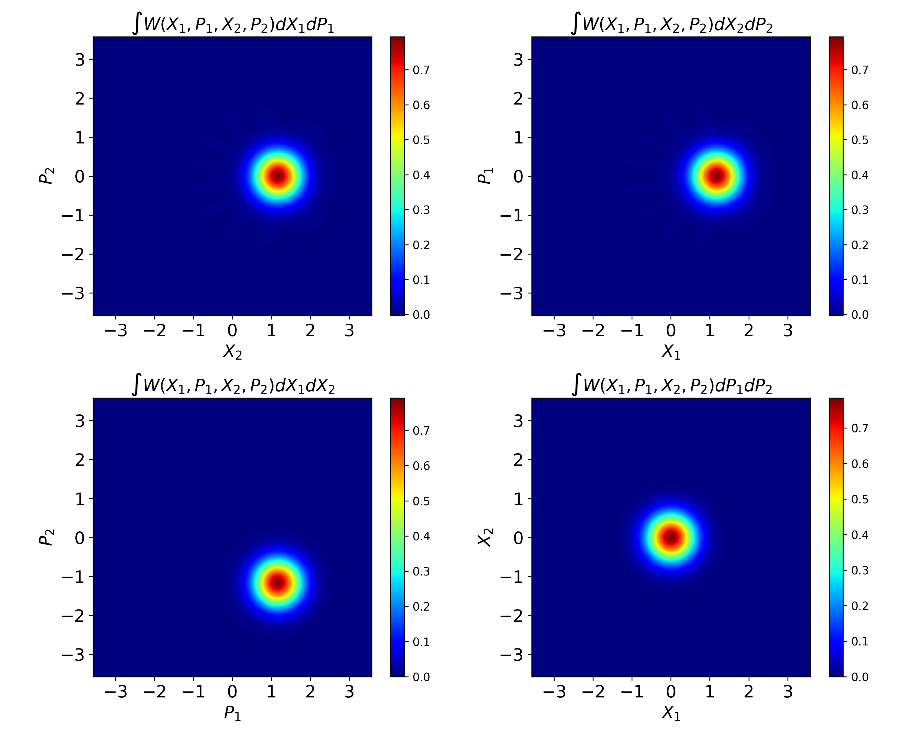
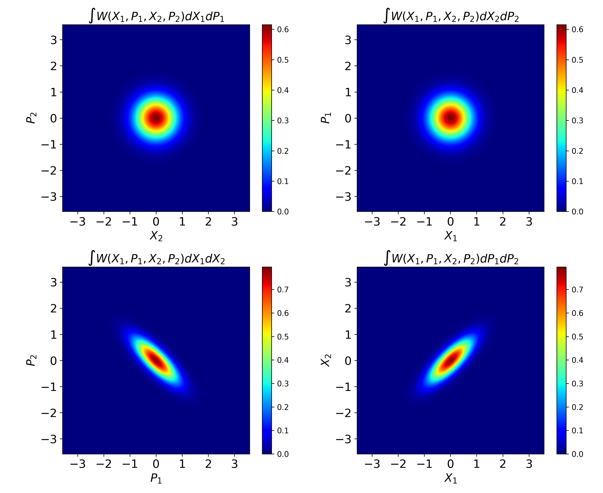
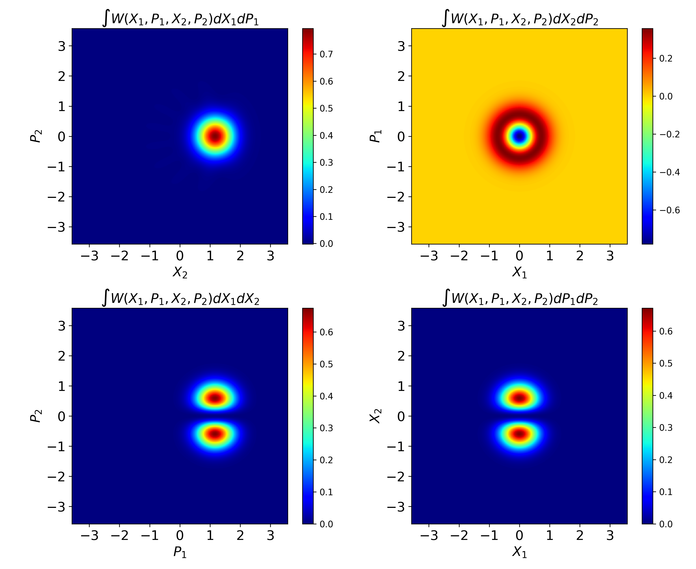

## Visualisation of the two-mode quantum state with two-mode Wigner function.

For two-mode state the Wigner function is defined as:

```math
\Gamma(n) = (n-1)!\quad\forall n\in\mathbb N
```

$$\sum_{i=0}^n i^2 = \frac{(n^2+n)(2n+1)}{6}$$


\\( \Gamma(n) = (n-1)!\quad\forall n\in\mathbb N \\)

$$\Gamma(n) = (n-1)!\quad\forall n\in\mathbb N $$

 

Here are examples of Wigner functions.

1) For two coherent states with \alpha=1.4 : \(|\psi \rangle = |\alpha\rangle{1}\otimes|\alpha\rangle{2} \)



2) For the two-mode squeezed vacuum state: \( | TMSV \rangle = \sqrt{1 - |z|^2} \sum{n=0}^{\infty} z^n |n\rangle{1}|n\rangle_{2} \)



3) For the coherent state and the single photon state: \(|\psi \rangle = |\alpha\rangle{1}\otimes|1\rangle{2} \)




References:
https://arxiv.org/abs/1911.11703


